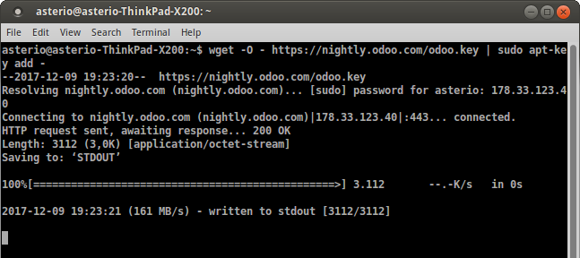
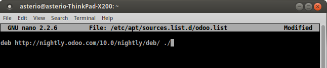

# Indice  

- Introducción y nota histórica.  
- Descripción de la instalación.  
- Funcionalidad.  
- Ventajas e inconvenientes del sistema.  
- Empresas que han implantado Odoo.

--------------------------------------------------------------------------------

# Introducción

\centering
\vspace{2cm}
\hspace{-5cm}
\includegraphics[scale=0.15]{./Imagenes/logo-odoo.png}

-  Suite de aplicaciones de código abierto para empresas (ERP) que cubre:  
	* CRM  
	* E-comercio  
	* Contabilidad  
	* Inventario  
	* Gestión de proyectos, de recursos humanos  
	* Campañas de marketing  
- Fácil de utilizar y totalmente integrado  
- Escrito en JavaScript y Python. Multiplataforma  
- Código completo en Github

--------------------------------------------------------------------------------

# Nota histórica

\centering
\vspace{3cm}
\hspace{-9.2cm}
\includegraphics[scale=0.35]{./Imagenes/tabla.png}

- Premio Deloitte por ser la compañía con crecimiento más rápido en Bélgica (crecimiento de 1549% en 5 años). Año 2013.  
- Nombrada una de las empresas con mayor crecimiento en Europa por Inc. Magazine. Año 2015.  

--------------------------------------------------------------------------------

# Descripción de la instalación  

- En primer lugar se añade la clave.

--------------------------------------------------------------------------------

# Descripción de la instalación  

- A continuación se añade el repositorio.

--------------------------------------------------------------------------------

# Descripción de la instalación  

\centering
\vspace{4cm}
\hspace{-5cm}
\includegraphics[scale=0.2]{./Imagenes/apt-get.png}

- Por último dejamos que apt-get haga su magia.  

--------------------------------------------------------------------------------

## Funcionalidad  

--------------------------------------------------------------------------------

# Sitios web

\centering
\vspace{2cm}
\hspace{-5cm}
\includegraphics[scale=0.15]{./Imagenes/sitios_web.png}

- Creador de sitios web.  
- Comercio electrónico.  
- Blog.  
- Foro.  
- Slides.  
- Chat en directo.

--------------------------------------------------------------------------------

# Ventas

\centering
\vspace{2cm}
\hspace{-5cm}
\includegraphics[scale=0.15]{./Imagenes/ventas.png}

- Ventas.  
- CRM.  
- Facturación.  
- Punto de venta.  
- Suscripciones.  
- Firmar.  

--------------------------------------------------------------------------------

# Operaciones  

\centering
\vspace{2.5cm}
\hspace{-5cm}
\includegraphics[scale=0.15]{./Imagenes/operaciones.png}  

- Contabilidad.  
- Proyecto.  
- Recursos humanos.  
- Inventario.  
- Compra.  
- Fabricación.  
- Servicio de asistencia.  

--------------------------------------------------------------------------------

# Herramientas de productividad  

\centering
\vspace{2.5cm}
\hspace{-5cm}
\includegraphics[scale=0.15]{./Imagenes/productividad.png}  

- Comunicación.  
- Hoja de horas.  
- Marketing electrónico.  
- Eventos.  
- Encuestas.  
- Citas.  
- Automatización de marketing.

--------------------------------------------------------------------------------

# Ventajas del sistema  

- Soporta multiples SO.
- Interfaz web.
- Baja especialización.
- Bien documentado.

--------------------------------------------------------------------------------

# Inconvenientes del sistema  

- No es gratuito.
- Aplicaciones muy rígidas.

--------------------------------------------------------------------------------

## Empresas que han implantado Odoo

--------------------------------------------------------------------------------

# Toyota  

- Fabrican carretillas elevadoras en Europa.  
- Usan Odoo Sales, Inventory, Manufacturing y Accounting.  
- El valor añadido para ellos es la implementación de módulos propios y la rapidez de implementación.

--------------------------------------------------------------------------------

# WWF  

\centering
\vspace{4cm}
\hspace{-4cm}
\includegraphics[scale=0.2]{./Imagenes/wwf.jpeg}  

- Preservación de árboles en el Parque Nacional de Virunga.  
- Odoo implementó funcionalidad agrícola solo para ellos.  
- Usan un módulo online de XPANSA para monitorear 4 millones de m2 de plantación.

--------------------------------------------------------------------------------

# Hyundai  

\centering
\vspace{1.5cm}
\hspace{-8cm}
\includegraphics[scale=0.2]{./Imagenes/hyundai_construction.jpeg}  

- Se encargan de tareas de ingeniería, construcción de barcos, construcción y manufacturación en general.  
- Odoo reemplazó a Nabicon y se ha integrado en la empresa junto a SAP, CERES y WMS.  
- Implementa inventario en tiempo real y extracción automática de informes.  
- Posee un portal de clientes para encargos y distribución a gran escala.
